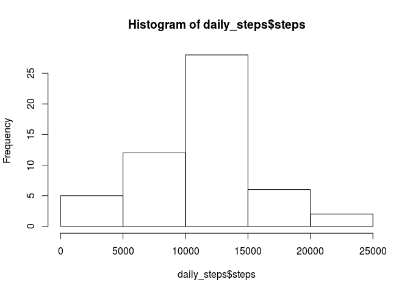
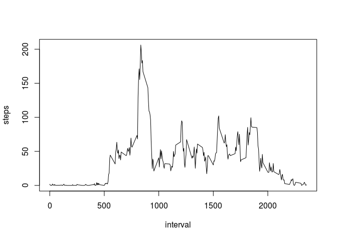
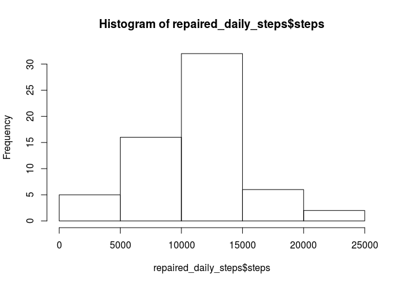
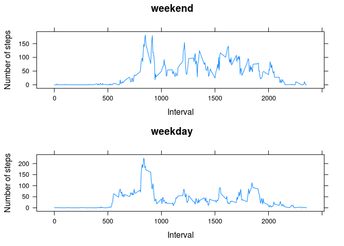

# Reproducible Research: Peer Assessment 1
Rohan Minehan  


## Loading and preprocessing the data

Load the raw data (with NA values)


```r
raw_data <- read.table(unz("activity.zip", "activity.csv"), header=T, sep=",")
# Convert date column to Date type
raw_data$date <- as.Date(raw_data$date, format = "%Y-%m-%d")
```

Create a cleaned set with no NA values. This is used for the questions where no missing values are imputed


```r
data <- na.omit(raw_data)
head(data)
```

```
##     steps       date interval
## 289     0 2012-10-02        0
## 290     0 2012-10-02        5
## 291     0 2012-10-02       10
## 292     0 2012-10-02       15
## 293     0 2012-10-02       20
## 294     0 2012-10-02       25
```


## What is mean total number of steps taken per day?

`daily_steps` will represent the total steps for each day.

#### Part 1 - daily mean


```r
daily_steps <- aggregate(data$steps, by=list(date=data$date), FUN=sum)
# Rename aggregation column 'x' to 'steps'
colnames(daily_steps)[2] <- "steps"
head(daily_steps)
```

```
##         date steps
## 1 2012-10-02   126
## 2 2012-10-03 11352
## 3 2012-10-04 12116
## 4 2012-10-05 13294
## 5 2012-10-06 15420
## 6 2012-10-07 11015
```

#### Part 2 - histogram


```r
hist(daily_steps$steps)
```

<!-- -->

#### Part 3 - mean and median of total steps per day


```r
mean(daily_steps$steps)
```

```
## [1] 10766.19
```

```r
median(daily_steps$steps)
```

```
## [1] 10765
```

The daily mean is `10766.19` and the daily median is `10765`.


## What is the average daily activity pattern?

#### Part 1 - time series plot across 5 minute intervals aggregated


```r
five_minute_steps <- aggregate(data$steps, by=list(interval=data$interval), FUN=mean)
# Rename aggregation column 'x' to 'steps'
colnames(five_minute_steps)[2] <- "steps"

plot(five_minute_steps, type="l")
```

<!-- -->

#### Part 2 - maximum steps


```r
index_with_max = which.max(five_minute_steps[, 2])
interval_with_max = five_minute_steps[index_with_max, "interval"]
```

The interval with the most steps on average is 835, ie. 8:35am.

## Imputing missing values

#### Part 1 - report missing values (NA's)


```r
colSums(is.na(raw_data))
```

```
##    steps     date interval 
##     2304        0        0
```

```r
num_missing_steps = sum(is.na(raw_data$steps))
```

There are 2304 missing steps.

#### Part 2 - devise a strategy for repaired data

Data is missing in daily blocks, ie. one data point is missing from a day if and only if all data points are missing from that day.

So trying to fill in missing values using values from the same day won't work. Similarly trying to fill values by using a global mean or median for that interval will mean that all missing days are exactly the same.

We will fill missing data "locally". For a particular interval, the mean of the surrounding intervals from nearby days is used. More precisely, the 3 days in front and behind.

#### Part 3 - create a repaired data set

The data set with missing data filled in will be called `repaired_data`.


```r
days_missing_data <- unique(raw_data[is.na(raw_data$steps),]$date)
repaired_data <- raw_data

for (date in days_missing_data) {
  from <- date - 3
  to <- date + 3
  chunk <- raw_data[raw_data$date >= from & raw_data$date <= to,]
  chunk <- na.omit(chunk)
  chunk_five_minute_steps <- aggregate(chunk$steps, by=list(interval=chunk$interval), FUN=mean)
  repaired_data[repaired_data$date == date, "steps"] <- chunk_five_minute_steps$x
}
```

#### Part 4 - daily histogram, mean and median for repaired data


```r
repaired_daily_steps <- aggregate(repaired_data$steps, by=list(date=repaired_data$date), FUN=sum)
colnames(repaired_daily_steps)[2] <- "steps"

hist(repaired_daily_steps$steps)
```

<!-- -->

```r
mean(repaired_daily_steps$steps)
```

```
## [1] 10640.72
```

```r
median(repaired_daily_steps$steps)
```

```
## [1] 10565.4
```

Both the repaired mean and median have decreased, ie. imputing data by using a local average has decreases these global estimates.


## Are there differences in activity patterns between weekdays and weekends?

#### Part 1 - create factor with levels "weekday" and "weekend"


```r
calculate_factor <- function(date) {
  day_of_week <- weekdays(date)
  if (day_of_week == 'Saturday' | day_of_week == 'Sunday') {
     return ('weekend')
  }
  else {
    return ('weekday')
  }
}

repaired_data$factor <- sapply(repaired_data$date, calculate_factor)
```

#### Part 2 - weekday vs weekend for each 5 minute interval


```r
analyze_factor <- function(factor_value) {
  library(lattice)
  factor_data <- repaired_data[repaired_data$factor == factor_value,]
  factor_five_minute_steps <- aggregate(factor_data$steps, by=list(interval=factor_data$interval), FUN=mean)
  colnames(factor_five_minute_steps)[2] <- "steps"
  return (xyplot(factor_five_minute_steps$steps ~ factor_five_minute_steps$interval, type = "l", xlab="Interval", ylab="Number of steps", main=factor_value))
}

weekend_plot <- analyze_factor('weekend')
weekday_plot <- analyze_factor('weekday')

require(gridExtra)
```

```
## Loading required package: gridExtra
```

```r
grid.arrange(weekend_plot, weekday_plot, nrow=2)
```

<!-- -->

A quick visual comparison shows that activity is spread more evenly through the day on the weekend. But on weekdays, activity spikes around 8:30am..
